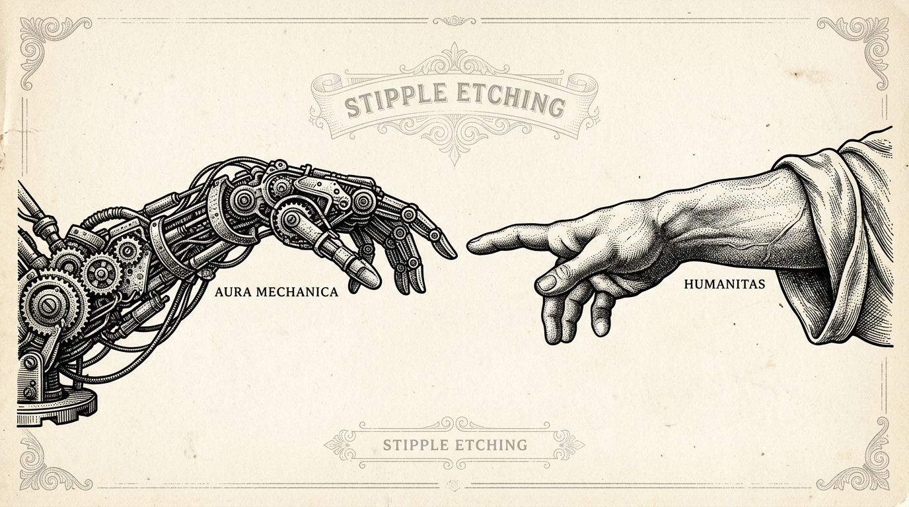
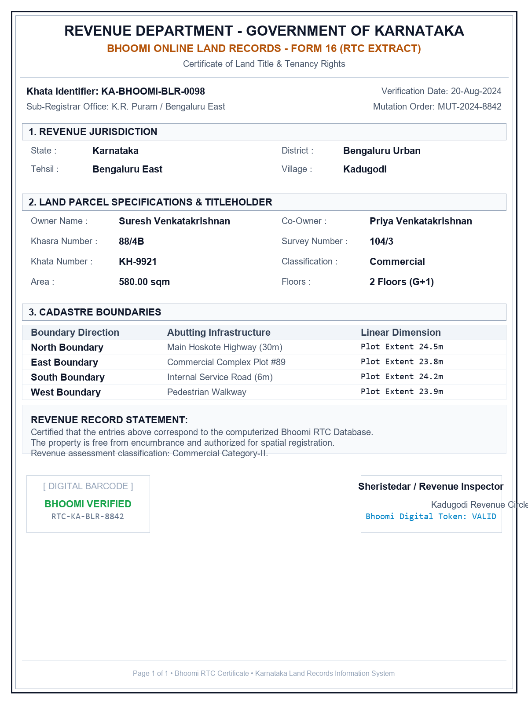
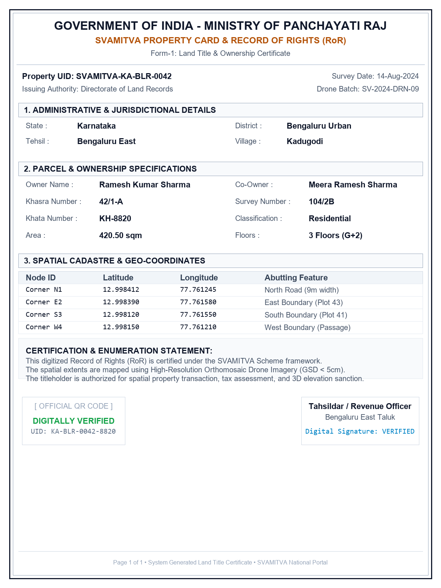

<div align="center">

# LANDX3D

### Land Records Normalizer and 3D Parcel Viewer

<b>
A geospatial workspace for turning land records into verified, explorable parcel data.
</b>

<p>


</p>

</div>

---

## Overview

LANDX3D is a browser-based land records platform that normalizes cadastral and property records into map-ready data. It combines document extraction, parcel geocoding, 2D and 3D visualization, verification queues, audit trails, and AI-assisted improvement workflows in one workspace.

The application includes sample SVAMITVA drone-cadastre and Bhoomi-style datasets for exploring the viewer without external data setup.

## Demo

<p align="center">
  
</p>

<b>Core workflow:</b>

```text
Land Records / CSV / GeoJSON / Images
                    │
                    ▼
          Normalize and Extract Fields
                    │
                    ▼
       Geocode and Match Parcel Footprints
                    │
                    ▼
          Verify Records and Exceptions
                    │
                    ▼
       Explore Parcels in the 2D / 3D Map
                    │
                    ▼
       Review Audit History and AI Feedback
```

## Features

- Document and image scanning for land records
- Browser-based OCR for handwritten and cursive records
- CSV, GeoJSON, and structured parcel data ingestion
- Record normalization, field validation, and unit conversion
- Parcel geocoding and building-footprint matching
- Interactive map with parcel selection and spatial analysis
- 3D building visualization with floor filtering and exploded-floor controls
- SVAMITVA, Kadugodi, and larger village dataset presets
- Review queue for unplaced or low-confidence records
- Audit trail for record and workflow changes
- AI feedback loop for improving extraction and normalization
- Analytics dashboard for dataset and processing insights
- Mobile scanning route at `/scan-mobile`
- Optional Supabase, Mapbox, and Gemini integrations

## Tech Stack

```text
                         LANDX3D WORKSPACE
  ┌────────────────────────────────────────────────────────┐
  │                 React + Vite Frontend                  │
  │  Map UI • Uploads • Scanner • Review • Audit • Analytics│
  └───────────────────────────┬────────────────────────────┘
                              │
              ┌───────────────┼────────────────┐
              ▼               ▼                ▼
  ┌──────────────────┐ ┌───────────────┐ ┌──────────────────┐
  │ deck.gl / Mapbox │ │ Local Pipeline │ │ Supabase Services │
  │ 2D + 3D Mapping  │ │ OCR + Normalize│ │ Storage + Data    │
  └──────────────────┘ └───────┬───────┘ └──────────────────┘
                               │
                               ▼
                    ┌─────────────────────┐
                    │ Gemini Vision OCR   │
                    │ Optional AI Service │
                    └─────────────────────┘
```

### Main libraries

- React 19 and Vite
- deck.gl and Mapbox GL for geospatial rendering
- Turf.js for geometry and area calculations
- Tesseract.js for browser OCR
- Gemini Vision for optional handwritten-record extraction
- Supabase JavaScript client for optional backend services
- PapaParse and SheetJS for tabular data import
- jsPDF for document generation
- Framer Motion and GSAP for interface motion

## Project Images

<p align="center">
  
  
</p>

---

## Installation Guide

### Prerequisites

Make sure you have the following installed:

- Node.js 18 or later
- npm, pnpm, or yarn
- Git
- Optional: Mapbox public access token
- Optional: Google Gemini API key for handwritten-record OCR

### 1. Clone the repository

```bash
git clone https://github.com/navaneesh1713/land-records-normalizer-and-3d-viewer-.git
cd land-records-normalizer-and-3d-viewer-
```

### 2. Install dependencies

```bash
npm install
```

### 3. Configure environment variables

Copy the example file to `.env.local`:

```bash
cp .env.example .env.local
```

Set values as needed:

```env
# Optional Mapbox public token. Leave blank to use the Carto fallback.
VITE_MAPBOX_TOKEN=

# Optional Gemini Vision configuration for handwritten/cursive OCR.
VITE_GEMINI_API_KEY=
VITE_GEMINI_MODEL=gemini-3.6-flash
```

The application can be explored with its bundled datasets without these optional values.

### 4. Run the development server

```bash
npm run dev
```

Open the local URL printed by Vite, typically:

```text
http://localhost:5173
```

### 5. Build for production

```bash
npm run build
npm run preview
```

### 6. Generate sample data

The repository includes a data-generation script for supported sample workflows:

```bash
npm run generate-data
```

## Application Routes

| Route | Purpose |
| --- | --- |
| `/` | LANDX3D landing page |
| `/home` | Main parcel map and 3D viewer |
| `/database` | Land database dashboard |
| `/upload` | Upload and normalization workspace |
| `/scanner` | Document scanning workspace |
| `/scan-mobile` | Mobile scanning view |
| `/audit` | Audit trail and record history |
| `/ailoop` | AI feedback and improvement loop |

## Project Structure

```text
land-records-normalizer-and-3d-viewer-/
├── public/
│   ├── hero_hands_stipple.jpg
│   ├── sample-bhoomi-deed.png
│   ├── sample-svamitva-property-card.png
│   └── sample-land-records.csv
├── schema/
│   └── target-parcel-schema.json
├── scripts/
│   ├── generate-data.js
│   └── generate-3-buildings-kadugodi.js
├── src/
│   ├── components/       # Map, panels, scanner, dashboards, and modals
│   ├── context/          # Shared React context
│   ├── data/             # Bundled parcel and OCR datasets
│   ├── i18n/             # Translation resources
│   ├── services/         # Storage, OCR, audit, API, and AI services
│   └── utils/            # Pipeline, geocoding, matching, and geometry logic
├── supabase/
│   └── schema.sql
├── .env.example
├── index.html
├── package.json
└── vite.config.js
```

## Data Pipeline

The normalization pipeline accepts structured and unstructured land records, detects the input shape, extracts relevant fields, normalizes units and identifiers, geocodes records, and matches them to parcel or building footprints. Records that cannot be placed are sent to the verification queue for review.

Bundled presets are available through the viewer:

- SVAMITVA Drone Dataset (Kadugodi)
- Bhoomi RoR 3-Complex (Bengaluru East)
- Full Village 8-Building Dataset

## Contributing

Contributions are welcome:

```bash
git checkout -b feature/your-feature
git commit -m "Add your feature"
git push origin feature/your-feature
```

Then open a Pull Request with a short description of the workflow or data behavior that changed.

---

<div align="center">

### Locate. Normalize. Verify. Visualize.

<b>LANDX3D turns complex land records into clear, actionable spatial data.</b>

</div>
